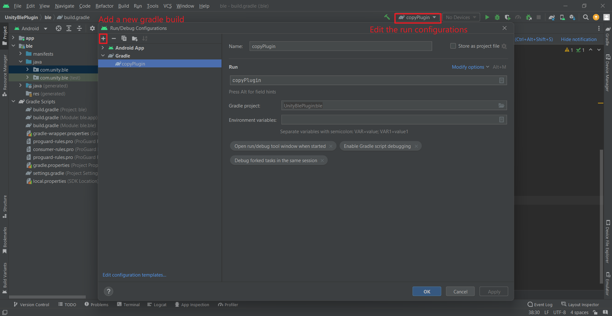
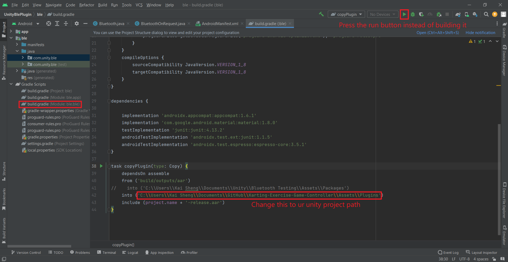

# Unity-BLE-Sample
Unity UWP BLE scripts &amp; Android Plugin sample

---
<br />

## UnityBlePlugin
This folder contains the source codes for the Android BLE plugin

> **Note:** U have to use Android Studio for the following tasks

1. The only folder to consider is the **ble** folder
2. Some things to take note of:


3. Also, from line 126-129

```java
AdvertiseData data = new AdvertiseData.Builder()
                .setIncludeDeviceName( false )
                .addManufacturerData(1, "ctrler".getBytes(StandardCharsets.UTF_8)) // Change "ctrler" to any string that has a length <= 10
                .build();
```

---
<br />

## Unity Android 
This folder contains the sample codes to invoke the methods in the plugin in Unity and also a manifest file to request for certain permissions

> **Note:** GameObjects used in the codes are based on my UI, so please ignore any UI-related codes.
> Also, u have to enable custom manifest file in ur Unity Android build settings

``
Callbacks are executed in a separate thread in Unity, meaning no UI elements can be called in that thread as they only run in the main thread.
To execute UI calls, u may pass the actions into the MainThread class.
``

---
<br />

## Unity UWP
This folder contains the Bluetooth script and the MainThread script

> **Note:** GameObjects used in the codes are based on my UI, so please ignore any UI-related codes.
> U won't be able to test the Bluetooth connection inside of Unity Editor, build the project as UWP and set the build type to Executable Only.
> Also, remember to tick the Bluetooth under Player Settings -> Publishing Settings -> Capabilities.
> To run the exe, launch the UWPPlayerLauncher.exe instead of {ur_project_name}.exe

1. Please refer to [Microsoft UWP BluetoothAdvertisement sample](https://github.com/microsoft/Windows-universal-samples/tree/main/Samples/BluetoothAdvertisement)
2. U may modify the sample from Microsoft and test it with ur game controller to see if they can communicate with each other. 
3. Remember to change the following:

```cs
private async void OnAdvertisementReceived(BluetoothLEAdvertisementWatcher watcher, BluetoothLEAdvertisementReceivedEventArgs eventArgs)
{
    if (bleDevice != null)
        return;
    var manufacturerSections = eventArgs.Advertisement.ManufacturerData;
    if (manufacturerSections.Count > 0)
    {
        var manufacturerData = manufacturerSections[0];
        var containedData = new byte[manufacturerData.Data.Length];
        using (var reader = DataReader.FromBuffer(manufacturerData.Data))
        {
            reader.ReadBytes(containedData);
        }
        
        if (Encoding.ASCII.GetString(containedData) == "ctrler") // change the string to the one u used in ur android plugin
        {
            isConnectingPanelActive = true;
            connectingPanelText = "Controller found, connecting";
            bleDevice = await BluetoothLEDevice.FromBluetoothAddressAsync(eventArgs.BluetoothAddress);
            watcher.Stop();
        }
    }
}
```

4. ``OnAdvertisementReceived`` processes all the advertisements and once it received the controller's advertisement, then it will stop receiving and ``OnAdvertisementWatcherStopped`` will be invoked.
5. Inside ``OnAdvertisementWatcherStopped``, the notification events are subscribed (``ControlCharacteristicValueChanged`` and ``StateCharacteristicValueChanged``)
6. Whenever u invoke ``SetCharacteristicValue`` from ur controller, the corresponding characteristic will be notified and depending on how u implement the handler, the received value can be used to control ur character or change the scene.
